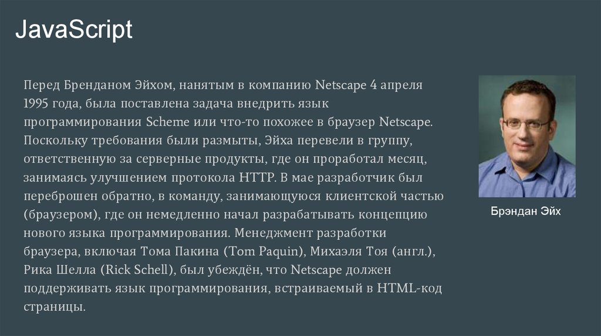
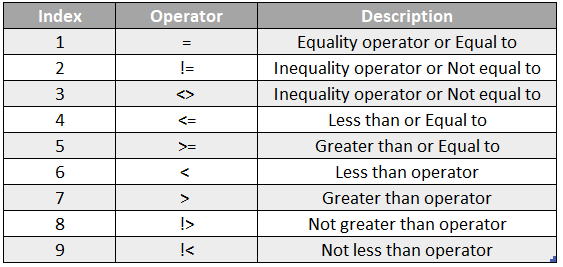

# ___JavaScript___
**JavaScript** - является одним из самых популярных языков программирования.
В прошлом **JavaScript** в основном использовался для создания веб-страницы, а сейчас его использоют во многих других областях, таких как - разработка серверной части, разработка приложений и так далее.

# ___JavaScript в других областях программирования___
**JavaScript** также используется во многих других областях, например: для создания динамичных эфектов и веб приложений для веб сайтов, а также во многом доугом (другие примеры внизу).

.42131cb0342fa57ce637ca4254eb58ca8fb48845.4e0329334881accb76ed8d8f1dc786bf879b16c6.png>)

# ___JavaScript  и его история___
**JavaScript** - был создан за 10 дней в 1995 году Бренданом Эйхом. В тот период времени **JavaScript** называли *Mocha*, затем Microsoft скопировал его из Netscape и дал название *JScript*.

# ___Переменные и константы в JavaScript___
В **JavaScript** существует 3 вида переменных: *var*, *let* и *const*. Var - глобальный, а let и const - локальный. Сейчас var мало кто использует, а let и const отличаются лиш тем, что значение  let можно изменить в любой момент, а const изменить нельзя. 

# ___Objrcts и Primitives___
В **JavaScript** существует 8 типов данных которые делятся на 2 вида это: *objects* и *primitives*. Primitives может принять лишь одно значание, objects - несколько. К primitives относятся - num, string, bool, undefined, null, simbol, bigint. А к objects - array, function, object literal, а также многое другое.

# ___Операторы в JavaScript___
В **JavaScript** есть несколько типов операторов. Данный раздел описывает каждый тип и содержит информацию об их приоритетах друг над другом.
JavaScript поддерживает двоичные и унарные операторы, а также еще один специальный тернарный оператор — условный оператор. Бинарная операция использует две операнды, одну перед оператором и другую за ними:
Например: 3+4 или x*y.

В результате операции применения операнду слева от инструмента применения (en-US)(знак "=") установлено значение , которое берется из правого операнда. Основным оператором применения является =, он присваивает значение правой операнды, остающейся слева. Таким образом, выражение x = y означает, что x соответствует значению y.

# ___Операторы сравнения JavaScript___
**JavaScript** предоставляет три оператора сравнения величин:
* равенство ("двойное равно") использует == (en-US),
- строгое равенство ("тройное равно" или "идентично") использует === (en-US),
- и Object.is (новшество из ECMAScript 6).

Выбор оператора зависит от типа сравнения, которое необходимо произвести.

В общих чертах, двойное равно перед сравнением величин производит приведение типов; тройное равно сравнивает величины без приведения (если величины разных типов, вернёт false, даже не сравнивая); ну и Object.is ведёт себя так же, как и тройное равно, но со специальной обработкой для NaN, -0 и +0, возвращая false при сравнении -0 и +0, и true для операции Object.is(NaN, NaN). (В то время как двойное или тройное равенство вернут false согласно стандарту IEEE 754.) Следует отметить, что все эти различия в сравнениях применимы лишь для примитивов. Для любых не примитивных объектов x и y, которые имеют одинаковые структуры, но представляют собой два отдельных объекта (переменные x и y не ссылаются на один и тот же объект), все операторы сравнения вернут false.

# ___Условные операторы If/else___
Инструкция *if* выполняет инструкцию, если указанное условие выполняется (истинно). Если условие не выполняется (ложно), то может быть выполнена другая инструкция.
Несколько команд if ... else могут быть вложены для создания условия else if. Обратите внимание, что в JavaScript нет ключевого слова *else if* (в одно слово).Не путайте примитивные логические значения true и false с правдивостью или ложностью булева объекта. Любое значение, которое не undefined, null, 0, NaN или пустая строка (""), и любой объект, включая объект Boolean, значение которого является ложным, считается правдивым при использовании в качестве условия. Например:

# ___Тернарный оператор___
Условный (тернарный) оператор -единственный оператор в **JavaScript**, включающий три операнды: условие, за которым следует знак знака (?), затем выражение, которое имеет значение, если условие имеет значение, сопровождающее двоеточием (:), и, наконец, выражение, которое означает показатель. , если условие ложно. Его часто используют в качестве сокращённой инструкции if...else.

Оператор возвращает значение выражения1, если условиеоно верно, и значение выражения2в противном случае. Например, чтобы вывести сообщение, текст которого зависит от значения переменной isMember, можно использовать такое выражение:

.png>)

# ___Switch___
## Сводка
Инструкция switch сравнивает выражение со случаями, перечисленными внутри неё, а затем выполняет соответствующие инструкции. Возвращает значение выражения1, если условиеоно верно, и значение выражения2в противном случае. Например, чтобы вывести сообщение, текст р возвращает значение выражения1, если условиеоно верно, и значение выраженияв противном случае. Например, чтобы вывести сообщение, текст 
## Синтаксис

#№ Описание
Если выражение соответствует какому-то случаю, то выполняются инструкции этого случая. Если несколько случаев соответствуют значению, только первый случай будет использован.

Сначала программа пытается найти подходящий случай, значение которого равно значению искомого выражения (используется строгое сравнение (en-US), ===) и затем выполняет инструкции, соответствующие случаю. Если подходящего случая нет, ищется случай по умолчанию (default), который не является обязательным. Если случая по умолчанию нет, выполнение продолжается на инструкции, следующей сразу после switch. По соглашению, случай default описывается последним, но это не является строгим правилом.

Опциональная инструкция break выполняет выход из блока switch. Она может располагаться в каждом из случаев, но не является обязательной. Если её нет, то выполняется следующая инструкция из блока switch.

# ___Функции___
Зачастую нам надо повторять одно и то же действие во многих частях программы.

Например, необходимо красиво вывести сообщение при приветствии посетителя, при выходе посетителя с сайта, ещё где-нибудь.

Чтобы не повторять один и тот же код во многих местах, придуманы функции. Функции являются основными «строительными блоками» программы.

Примеры встроенных функций вы уже видели – это alert(message), prompt(message, default) и confirm(question). Но можно создавать и свои.

.png>)